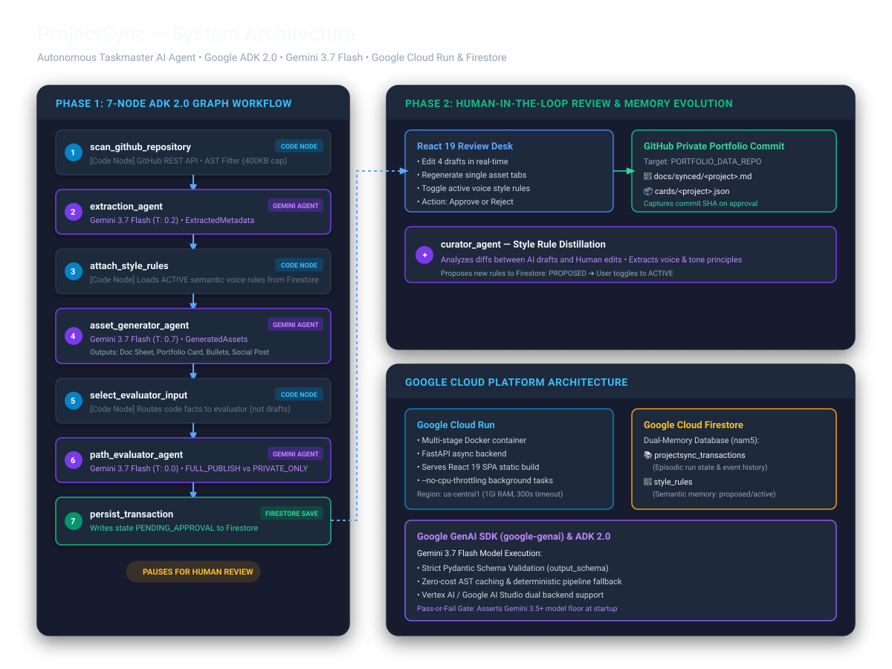

# ProjectSync

Paste a GitHub URL. Get a documentation sheet, a portfolio card, resume bullets, and a social post — reviewed by you before anything is committed.

Most finished projects never get a portfolio entry, because writing one by hand is
tedious enough to skip. ProjectSync does that work in one pass, asks for a single
approval, then commits the results to your repositories. It also learns how you
write: every edit you make feeds a rule that changes the next draft.

Built for the Taskmaster track of the All Things Agentic Hackathon on a
six-node [Google ADK 2.0](https://pypi.org/project/google-adk/) graph workflow.

## Architecture

<p align="center">
  
</p>

## Features

- **One trigger, four assets.** A single request produces a markdown doc sheet, a
  JSON portfolio card, resume bullets, and a post draft — from one model call, so
  the four never disagree about the same project.
- **A publish gate that can say no.** A zero-temperature evaluator checks for a
  real README, tests, a licence, and leftover secrets or TODOs. A working repo can
  still fail. `FULL_PUBLISH` or `PRIVATE_ONLY`, with reasons.
- **Nothing is committed without you.** The run stops at `PENDING_APPROVAL` and
  writes to Firestore. Approval arrives as a separate request, minutes or days
  later.
- **A memory you can audit.** Style rules live in Firestore, are read fresh on
  every run, and start as `PROPOSED` — a rule only takes effect after you turn it
  on. Each transaction records which rules produced its draft.
- **Deterministic steps stay deterministic.** Four of the seven nodes are plain
  Python: the repository scan, the rule lookup, the choice of what the evaluator
  reads, and the Firestore write. No model
  is asked to do exact work.
- **A review desk, not a dashboard.** The interface at `/` shows the seven graph
  nodes as a ledger, the four drafts as editable folios, and the verdict as a
  stamp. Your edits travel with the approval. Vite builds it into static files
  that FastAPI sends, so one container serves the API and the interface together
  and no Node runs in the image.
- **One private portfolio repository.** Both the documentation sheet and the
  portfolio card commit to `PORTFOLIO_DATA_REPO`. The scanned repository is never
  written to.

## Repository Structure

```
├── docs/          # Architecture specs, workflow guides, diagrams, and deployment docs
├── memory/        # Style curation engine and rule extraction from user edits
├── nodes/         # Google ADK graph nodes (scanner, rules, extractor, generator, evaluator, persist)
├── routes/        # FastAPI HTTP route handlers for pipeline triggers, reviews, rules, and exports
├── static/        # Pre-built frontend static assets (HTML/CSS/JS) served directly by FastAPI
├── sync/          # GitHub commit integration for syncing approved assets to portfolio repositories
├── tests/         # Test suite including offline fixture tests, node tests, and live model tests
├── tools/         # Utility scripts (design token and M3 palette generation)
├── web/           # React + TypeScript single-page application (review desk UI)
├── graph.py       # Google ADK workflow graph orchestration
├── main.py        # FastAPI server entry point and lifespan configuration
├── models.py      # Pydantic schemas for transactions, assets, rules, and evaluations
├── store.py       # Firestore persistence and transaction storage layer
├── config.py      # Environment configuration and settings validation
└── adk_runtime.py # Google ADK execution runtime helpers
```

### Folder Breakdown

- **[`docs/`](docs/)**: Project documentation, architecture diagrams, and development specifications.
  - Architecture diagram assets ([`architecture_diagram.svg`](docs/architecture_diagram.svg), [`architecture_diagram.png`](docs/architecture_diagram.png)).
  - Agent workflows and routing specifications ([`AGENT.md`](docs/AGENT.md), [`AGENT_WORKFLOW.md`](docs/AGENT_WORKFLOW.md)).
  - API reference and endpoint specs ([`API_REFERENCE.md`](docs/API_REFERENCE.md)).
  - Cloud Run and GCP deployment instructions ([`DEPLOYMENT.md`](docs/DEPLOYMENT.md)).
  - Hackathon project writeup ([`devpost_submission.md`](docs/devpost_submission.md)).

- **[`memory/`](memory/)**: Adaptive learning and style curation logic.
  - [`curator.py`](memory/curator.py): Compares user edits against original drafts and extracts proposed style rules so future asset generation adapts to the user's personal writing voice.

- **[`nodes/`](nodes/)**: The six core Google ADK 2.0 graph workflow nodes.
  - [`scanner.py`](nodes/scanner.py): Deterministic GitHub repository ingestion (fetches file trees, README, package manifests, and code samples).
  - [`style_rules.py`](nodes/style_rules.py): Retrieves active user style rules from Firestore.
  - [`extraction.py`](nodes/extraction.py): Gemini model call extracting structured project facts, architecture details, and tech stack information.
  - [`generator.py`](nodes/generator.py): Gemini model call synthesizing all 4 assets (doc sheet, portfolio card, resume bullets, social post) adhering to active style rules.
  - [`evaluator.py`](nodes/evaluator.py): Zero-temperature quality gate assessing repository completeness (`FULL_PUBLISH` vs. `PRIVATE_ONLY`).
  - [`persist.py`](nodes/persist.py): Saves transaction state, graph outputs, and draft assets to Firestore with `PENDING_APPROVAL` status.

- **[`routes/`](routes/)**: FastAPI REST API route handlers.
  - [`phase1.py`](routes/phase1.py): Pipeline execution trigger (`POST /api/v1/trigger-sync`).
  - [`phase2.py`](routes/phase2.py): User approval callback and commit dispatch (`POST /api/v1/approval-callback`).
  - [`transactions.py`](routes/transactions.py): Transaction status and ledger retrieval (`GET /api/v1/transactions/{id}`).
  - [`regenerate.py`](routes/regenerate.py): Re-running asset generation with updated active rules (`POST /api/v1/regenerate-asset`).
  - [`rules.py`](routes/rules.py): Style rule CRUD operations and state toggles (`GET/POST /api/v1/rules`, `/rules/{id}`).
  - [`bullets.py`](routes/bullets.py) & [`social.py`](routes/social.py): Resume bullet queries and social post export endpoints.

- **[`static/`](static/)**: Production distribution files for the web interface.
  - Compiled HTML, bundled JavaScript/CSS, and web fonts (Geist Sans, Geist Mono, Instrument Serif), allowing FastAPI to serve the complete frontend without requiring Node.js in the production runtime container.

- **[`sync/`](sync/)**: Git and repository synchronization.
  - [`github.py`](sync/github.py): Handles authenticated GitHub commits to write approved markdown documentation sheets and JSON portfolio cards to `PORTFOLIO_DATA_REPO`.

- **[`tests/`](tests/)**: Automated test suite.
  - [`test_nodes.py`](tests/test_nodes.py): Unit tests for individual ADK graph nodes.
  - [`test_fixture_run.py`](tests/test_fixture_run.py): Full offline graph execution using canned responses (`fixtures/canned_transaction.json`).
  - [`test_approval_commits.py`](tests/test_approval_commits.py): Tests Phase 2 approval flow and GitHub commit dispatching.
  - [`test_style_rules_change_output.py`](tests/test_style_rules_change_output.py): Live model integration test verifying active style rules alter generation output.
  - [`test_design_tokens.py`](tests/test_design_tokens.py): Verification of design system tokens.

- **[`tools/`](tools/)**: Developer and build utilities.
  - Palette and Material 3 design token generation scripts ([`gen_palette.py`](tools/gen_palette.py), [`gen_m3_palette.py`](tools/gen_m3_palette.py)).

- **[`web/`](web/)**: Frontend single-page application built with React 19, TypeScript, and Vite.
  - [`src/screens/`](web/src/screens/): Screen views — `Intake` (repo URL submission), `Run` (live node ledger), `Review` (4-asset editor & verdict stamp), `Portfolio` (interactive card deck), and `Library` (resume bullets & rules manager).
  - [`src/ui/`](web/src/ui/): Atomic design UI components (`Button`, `Card`, `Stamp`, `Field`, `Menu`, `Tag`, `Switch`, etc.).
  - [`src/portfolio/`](web/src/portfolio/): Portfolio card rendering, 3D flip interactions, and canvas card drawing.
  - [`src/library/`](web/src/library/): Grouped resume bullet lists and style rule controls.
  - [`src/hooks/`](web/src/hooks/): React custom hooks for transaction polling, review state, theme switching, and API interaction.
  - [`src/styles/`](web/src/styles/): CSS design tokens, typography, motion keyframes, and layout styles.
  - [`src/api/`](web/src/api/): Typed REST API client and interface definitions.

## Installation

Requires [Python 3.12](https://www.python.org/downloads/) and
[uv](https://docs.astral.sh/uv/getting-started/installation/).

```bash
git clone https://github.com/<owner>/projectsync.git
cd projectsync
uv sync
```

Then create your `.env`:

```bash
cp .env.example .env
```

Open `.env` and set two values to start:

| Variable | Where to get it |
|---|---|
| `GOOGLE_API_KEY` | [aistudio.google.com/apikey](https://aistudio.google.com/apikey) |
| `GITHUB_TOKEN` | [github.com/settings/tokens](https://github.com/settings/tokens) — needs the `repo` scope |

`GOOGLE_CLOUD_PROJECT` and `PORTFOLIO_DATA_REPO` are needed before the first real
run, but not before the checks below.

Firestore needs credentials of its own — an API key is not enough. Pick one:

```bash
gcloud auth application-default login    # real Firestore in your project
```

```bash
gcloud emulators firestore start --host-port=localhost:8081
export FIRESTORE_EMULATOR_HOST=localhost:8081   # no billing, no real data
```

The emulator still wants `GOOGLE_CLOUD_PROJECT` set to any non-empty string. Without
either of these, every endpoint that touches Firestore answers `503` and names the
settings that are still empty.

## Quickstart

Run the offline checks. These need no API key and make no model call:

```bash
uv run pytest tests/test_nodes.py -q
```

Start the API:

```bash
uv run uvicorn main:app --reload --port 8080
```

The interface takes one build first: `cd web`, then `npm ci`, then `npm run build`.
Open <http://localhost:8080> for it. Paste a repository URL there and the rest of
this section happens in the browser. The commands below are the same
flow over `curl`, for a demo or a script.

Confirm it is up. The reply tells you which settings are still missing:

```
$ curl -s localhost:8080/healthz
{"status":"ok","model":"gemini-3.5-flash","use_vertex_ai":false,"missing_config":["PORTFOLIO_DATA_REPO"]}
```

Now run the pipeline on a repository:

```bash
curl -X POST localhost:8080/api/v1/trigger-sync \
  -H 'Content-Type: application/json' \
  -d '{"repo_url":"https://github.com/tiangolo/fastapi","user_id":"me"}'
```

You get a transaction id back at once. The graph keeps running behind the
request, so poll for the result:

```bash
curl -s localhost:8080/api/v1/transactions/<transaction_id>
```

When `status` is `PENDING_APPROVAL`, read the drafts in `assets` and the verdict in
`recommendation`. Approve to write both commits:

```bash
curl -X POST localhost:8080/api/v1/approval-callback \
  -H 'Content-Type: application/json' \
  -d '{"transaction_id":"<transaction_id>","approved":true}'
```

Both the doc sheet and the portfolio card land in `PORTFOLIO_DATA_REPO` under
`docs/synced/` and `cards/` respectively. The scanned repository is never written
to. The two commits are independent: if one fails, the row records that and stays
open for a retry.

### Teaching it your voice

Rules start as `PROPOSED` and do nothing until you activate one:

```bash
curl -X POST localhost:8080/api/v1/rules \
  -H 'Content-Type: application/json' \
  -d '{"user_id":"me","text":"Never open a post with Excited to share."}'

curl -X POST localhost:8080/api/v1/rules/<rule_id> \
  -H 'Content-Type: application/json' -d '{"state":"ACTIVE"}'
```

Then regenerate an open transaction to see the rule take effect — no rescan, no
new extraction call, and no restart:

```bash
curl -X POST localhost:8080/api/v1/regenerate-asset \
  -H 'Content-Type: application/json' \
  -d '{"transaction_id":"<transaction_id>"}'
```

## API reference

| Method | Path | Does |
|---|---|---|
| `POST` | `/api/v1/trigger-sync` | Starts Phase 1. Returns a transaction id at once. |
| `GET` | `/api/v1/transactions/{id}` | The state of one transaction. Poll this. |
| `POST` | `/api/v1/regenerate-asset` | Rewrites the four assets with the rules that are active now. |
| `POST` | `/api/v1/approval-callback` | Writes the two commits, then looks for a new rule. |
| `GET` `POST` | `/api/v1/rules` | Lists rules, or adds one by hand. |
| `POST` | `/api/v1/rules/{id}` | Sets a rule to `ACTIVE`, `INACTIVE`, or `PROPOSED`. |
| `GET` | `/healthz` | Liveness, the pinned model, and any missing settings. |
| `GET` | `/` | The interface. The built files are under `/assets`. |

Interactive docs are at `/docs` once the server is running.

## Configuration

Every setting is an environment variable, listed in
[`.env.example`](.env.example). Four names are fixed by the Google GenAI SDK and
must be spelled exactly: `GOOGLE_GENAI_USE_VERTEXAI`, `GOOGLE_API_KEY`,
`GOOGLE_CLOUD_PROJECT`, and `GOOGLE_CLOUD_LOCATION`. A near miss such as
`GEMINI_API_KEY` is ignored without an error.

`MODEL_ID` defaults to `gemini-3.5-flash`. The application refuses to start on a
model below Gemini 3.5, because the hackathon floor is a pass-or-fail gate.

## Development

```bash
uv run pytest tests/ -q          # offline tests (66 pass, 1 skipped)
uv run ruff check .              # lint
```

One test makes a real model call and is skipped by default. It is the test that
proves the memory is not a prop — it generates the same project twice, once with a
rule that bans an opening line, and fails if the line survives:

```bash
RUN_LIVE_TESTS=1 uv run pytest tests/test_style_rules_change_output.py -v
```

### Reproducible Testing

All offline tests run without any API keys or external services. The test suite
uses a **fixture mode** (`FIXTURE_MODE=1`) that replaces model calls with canned
responses, so the full graph executes and writes the same event log as a real run.

```bash
# 1. Install dependencies
uv sync
cd web && npm ci && npm run build && cd ..

# 2. Run offline test suite (no API keys needed)
uv run pytest tests/ -q
# Expected: 66 passed, 1 skipped

# 3. Run live model test (requires GOOGLE_API_KEY in .env)
RUN_LIVE_TESTS=1 uv run pytest tests/test_style_rules_change_output.py -v

# 4. Lint
uv run ruff check .
```

Frontend tests (Vitest + React Testing Library):

```bash
cd web
npm run test
# 68 tests pass
```

To build the container:

```bash
docker build -t projectsync .
```

Design documents live in [`docs/`](docs/). Start with
[`docs/AGENT.md`](docs/AGENT.md) for the routing table, and
[`docs/VERIFICATION_LEDGER.md`](docs/VERIFICATION_LEDGER.md) for every API claim
with the source that confirms it. The product spec is
[`projectsync_full_spec.md`](projectsync_full_spec.md).

## License

Apache-2.0 — see [`LICENSE`](LICENSE).
